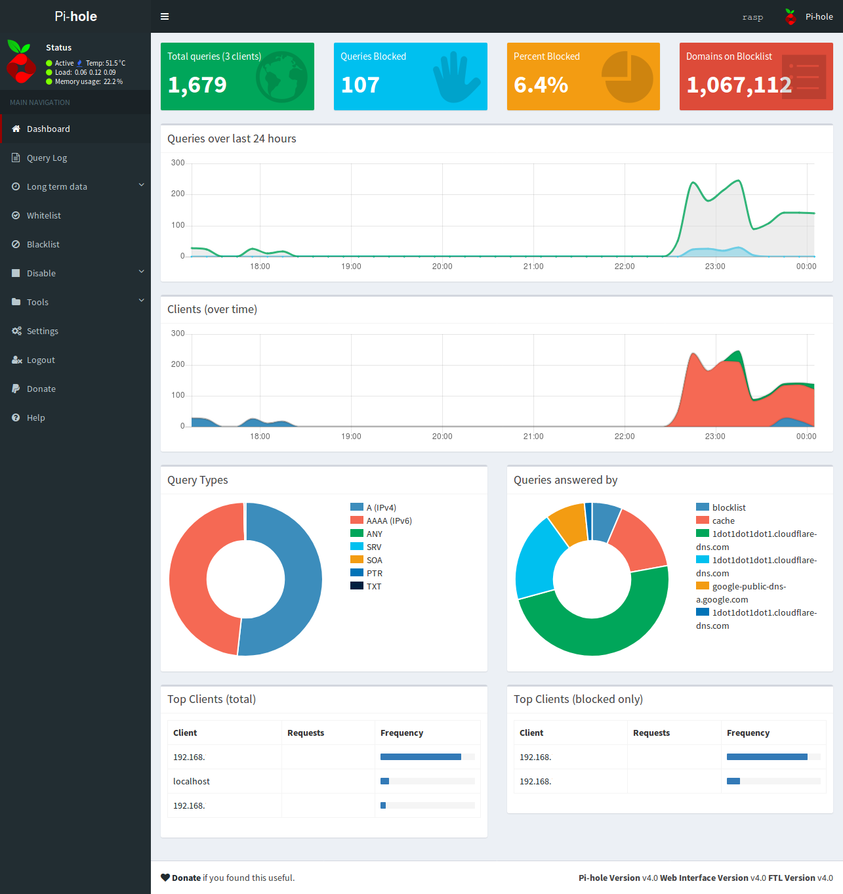

# Night Pi Hole
Custom dark theme CSS for pi-hole to replace skin-blue AdminLTE theme.

❗ Created for use with [pi-hole](https://github.com/pi-hole/pi-hole).



---

## Install
Type the following commands into SSH, line by line.

```
cd /var/www/html/admin/style/vendor/
sudo git clone https://github.com/thomasbnt/Night_PiHole.git
sudo rm -f skin-blue.min.css
sudo cp Night_PiHole/skin-blue.min.css .
sudo rm -rf Night_PiHole
```
Don't forget the trailing " ." on the cp line (it means copy to current directory).

## Uninstall/Revert
Type the following commands into SSH, line by line.

```
cd /var/www/html/admin/style/vendor/
sudo git reset --hard
```

---

### License
This project is licensed under the MIT License - see the [LICENSE](LICENSE) file for details.
