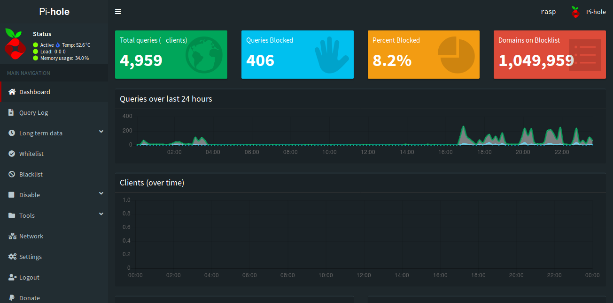

[](https://thomasbnt.fr/discord/?utm_source=link_github?utm_medium=github)
[](https://www.patreon.com/thomasbnt)
[](https://twitter.com/Hyprimort)
[](LICENSE)

# Night Pi-hole
Custom dark theme CSS for Pi-hole to replace skin-blue AdminLTE theme.

❗ Created for [Pi-hole](https://github.com/pi-hole/pi-hole).



---

## Install
Type the following commands into SSH, line by line.

```bash
cd /var/www/html/admin/style/vendor/
sudo git clone https://github.com/thomasbnt/Night_Pihole.git
cd Night_Pihole
sudo chmod +x install.sh
sudo ./install.sh
```

## Uninstall/Revert
Type the following commands into SSH, line by line.

```
cd /var/www/html/admin/style/vendor/
sudo git reset --hard
```

---

### License
This project is licensed under the MIT License - see the [LICENSE](LICENSE) file for details.


[💛 Pi-hole](https://github.com/topics/pihole)
